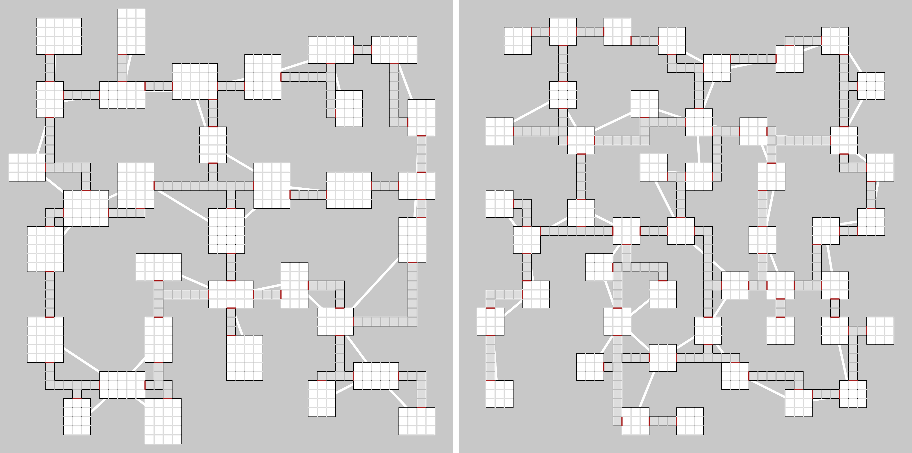

# Dungeon Generation

## Description

Dungeon generation on tile grid. 

You can open the online version by [clicking here](https://kasperado.github.io/DungeonGeneration/).

## Installation

You don't need to install anything, simply open index.html after downloading the repository.

You will need internet connection, since p5.js library is loaded in using CDN.

## Dependencies:  
> https://github.com/processing/p5.js  